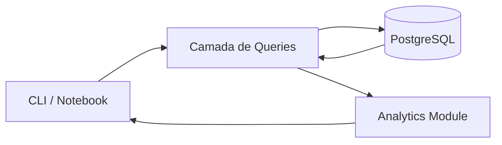

# 🎓 Student Performance Analytics — Data Engineering Project

Um projeto completo de **Data Engineering + Analytics**, construído do zero utilizando  
**PostgreSQL + Python + CLI + Analytics + Jupyter Notebook**.

Este projeto demonstra um fluxo real de Engenharia de Dados:

**Ingestão → Armazenamento → CRUD → Analytics → Visualização**

---

## 📌 Objetivos do Projeto

- Criar um banco de dados de estudantes no **PostgreSQL**
- Construir uma aplicação **CLI** para CRUD completo:
  - Criar tabela
  - Inserir estudante
  - Atualizar estudante
  - Deletar estudante
  - Listar estudantes
  - Ver resumo analítico
- Implementar um módulo de **analytics**
  - Média por disciplina  
  - Top N estudantes  
  - Estatísticas gerais  
- Criar um **Notebook de EDA (Exploratory Data Analysis)** usando Pandas
- Mostrar uma arquitetura limpa e modular para portfólio

---

## 🏛️ Arquitetura do Projeto



## 🧱 Estrutura do Projeto
```
student-performance-analytics/
├── database/
│   ├── database.py         # conexão com Postgres
│   ├── models.py           # dataclass Student
│   └── queries.py          # CRUD + consultas
├── src/
│   ├── cli/
│   │   └── main.py         # interface de linha de comando
│   └── analytics/
│       └── marks_analysis.py
├── notebooks/
│   └── exploratory_analysis.ipynb
├── docs/
│   └── architecture.md
├── .venv/
├── .env.example
├── README.md
├── pyproject.toml
└── uv.lock
```

🛠️ Stack utilizada

- Python 3.11
- PostgreSQL
- uv (gerenciamento de ambiente e dependências)
- Pandas
- Matplotlib
- psycopg2
- Jupyter Notebook

▶️ Como rodar o projeto
1. Clone o repositório

```python
git clone https://github.com/faria-lucas/student-performance-analytics.git
cd student-performance-analytics
```

2. Criar e ativar ambiente virtual (usando uv)
```bash
uv venv .venv
source .venv/bin/activate
```

3. Instalar dependências
```bash
uv pip install -r requirements.txt  # se você gerar um
```
# ou
```bash
uv pip install jupyter pandas matplotlib psycopg2-binary python-dotenv
```

4. Criar arquivo .env

Copie o exemplo:

```bash
cp .env.example .env
```

Preencha com seus dados do PostgreSQL.

5. Executar a CLI
```bash
python -m src.cli.main
```

Menu exibido:

1. Criar/verificar tabela
2. Inserir estudante
3. Listar estudantes
4. Deletar estudante
5. Atualizar estudante
6. Ver resumo de analytics
0. Sair

Executar o módulo de analytics diretamente
```bash
python -m src.analytics.marks_analysis
```

Abrir o notebook EDA jupyter notebook

Abra:

```bash
notebooks/exploratory_analysis.ipynb
```

**📊 Exemplo de perguntas analisadas no notebook**

- Qual disciplina tem melhor média?
- Qual estudante tem melhor desempenho?
- A idade influencia nas notas?
- Como está distribuída a performance geral?
- Existe diferença por gênero?

**🌟 Destaques Técnicos**

- Projeto 100% modular — camada de dados separada da lógica.
- CLI profissional usando python -m.
- Conexão ao PostgreSQL com variáveis seguras via .env.
- Analytics de verdade com Pandas.
- Notebook que conecta diretamente no banco.
- Estrutura pensada para escalabilidade (API FastAPI pode ser adicionada depois).
- Fluxo completo de engenharia de dados.

**📄 Licença**

MIT License.
