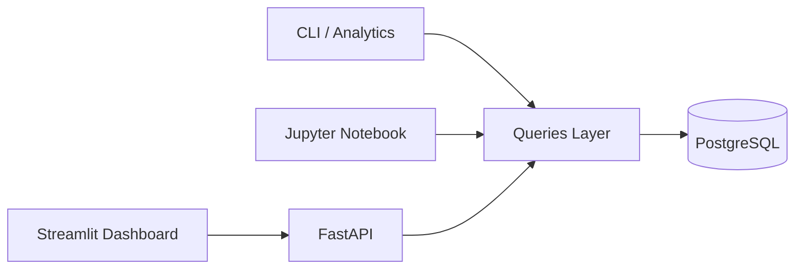

# 🎓 Student Performance Analytics, Data Engineering Project

A complete **Data Engineering + Analytics** project, built from scratch using
**PostgreSQL + Python + CLI + Analytics + Jupyter Notebook + API + Dashboard**.

This project demonstrates a real-world Data Engineering workflow:

**Ingestion → Storage → CRUD → Analytics → Visualization**

---

## 📌 Project Objectives

* Create a student database using **PostgreSQL**
* Build a **CLI application** to perform full CRUD operations:

  * Create table
  * Insert student
  * Update student
  * Delete student
  * List students
  * View analytics summary
* Implement an **analytics module**

  * Average score by subject
  * Top N students
  * General statistics
* Create an **EDA (Exploratory Data Analysis) Notebook** using Pandas
* Showcase a clean and modular architecture for portfolio purposes
* Build a **REST API with FastAPI** on top of PostgreSQL
* Create an **interactive dashboard with Streamlit**, consuming the API
* Demonstrate communication between services (UI → API → Database)

---

## 🏛️ Project Architecture



---

## 🧱 Project Structure

```bash
student-performance-analytics/
├── database/
│   ├── database.py         # PostgreSQL connection
│   ├── models.py           # Student dataclass
│   └── queries.py          # CRUD + SQL queries
├── src/
│   ├── api/                # FastAPI (application layer)
│   │   └── main.py         # API entrypoint
│   ├── cli/
│   │   └── main.py         # command-line interface
│   ├── analytics/
│   │   └── marks_analysis.py
│   └── dashboard/
│       └── app.py          # Streamlit dashboard (consumes the API)
├── notebooks/
│   └── exploratory_analysis.ipynb
├── scripts/
│   └── dev.sh              # runs API and dashboard together
├── docs/
│   └── architecture.md
├── .venv/
├── .env.example
├── README.md
├── pyproject.toml
└── uv.lock
```

---

## 🛠️ Tech Stack

* Python 3.11
* PostgreSQL
* uv (environment and dependency management)
* FastAPI
* Streamlit
* Pandas
* Matplotlib
* psycopg2
* Jupyter Notebook

---

## ▶️ How to run the project

### 1. Clone the repository

```bash
git clone https://github.com/faria-lucas/student-performance-analytics.git
cd student-performance-analytics
```

---

### 2. Create and activate the virtual environment (using uv)

```bash
uv venv .venv
source .venv/bin/activate
```

---

### 3. Install dependencies

```bash
uv pip install -r requirements.txt  # if you generate one
```

or

```bash
uv pip install jupyter pandas matplotlib psycopg2-binary python-dotenv
```

---

### 4. Create the `.env` file

Copy the example file:

```bash
cp .env.example .env
```

Fill it with your PostgreSQL credentials.

---

### 5. Run the CLI

```bash
python -m src.cli.main
```

Menu options:

1. Create / verify table
2. Insert student
3. List students
4. Delete student
5. Update student
6. View analytics summary
7. Exit

---

### Run the analytics module directly

```bash
python -m src.analytics.marks_analysis
```

---

### Open the EDA notebook

```bash
notebooks/exploratory_analysis.ipynb
```

---

## 📊 Example questions explored in the notebook

* Which subject has the highest average score?
* Which student performs best overall?
* Does age influence performance?
* How is the overall score distribution?
* Are there performance differences by gender?

---

## 🌟 Technical Highlights

* 100% modular project — data layer fully separated from business logic.
* Professional CLI execution using `python -m`.
* Secure PostgreSQL connection via environment variables (`.env`).
* Real analytics implemented with Pandas.
* Jupyter notebook connected directly to the database.
* Architecture designed for scalability (FastAPI API and Dashboard already integrated).
* Complete end-to-end data engineering workflow.

---

## 🚀 API — FastAPI Layer (CRUD over PostgreSQL)

This project includes a complete **REST API built with FastAPI**, using the same
data access layer as the CLI. The API exposes endpoints to create, retrieve,
update, and delete students in the PostgreSQL database.

The API can be used for:

* integration with front-ends (React, Streamlit, Next.js)
* automation and external integrations
* consumption by other services

---

### ▶️ How to start the API

With the virtual environment activated:

```bash
uvicorn src.api.main:app --reload --port 8000
```

---

## 📊 Dashboard — Streamlit UI

The project includes an **interactive Streamlit dashboard** that consumes the FastAPI backend via HTTP,
following a clear separation of responsibilities:

**Dashboard → API → PostgreSQL**

Dashboard features:

* View all students in a table
* Filter students by subject and gender
* Visualize average marks by subject
* Display Top N students
* Create new students
* Update students (partial updates)
* Delete students by ID

The dashboard **does not connect directly to the database**.
All data access is handled exclusively by the FastAPI backend.

---

## ▶️ How to run locally (API + Dashboard)

With the virtual environment activated:

```bash
./scripts/dev.sh
```

---

## 📄 License

MIT License.
